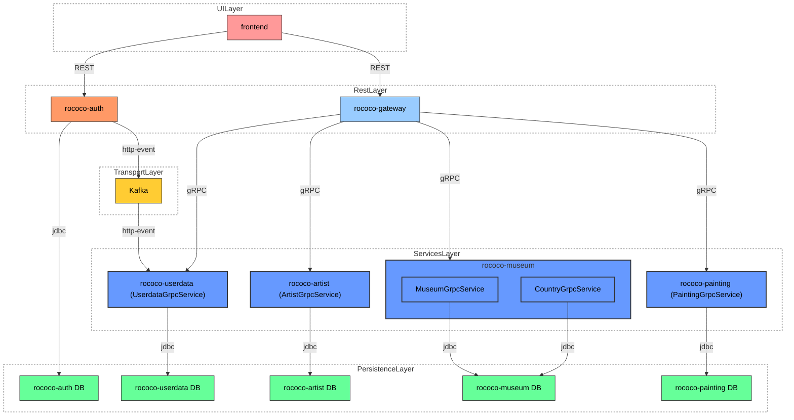

# Rococo - Система управления музейными коллекциями

## Описание проекта

Rococo — это дипломный проект курса QA.GURU Java Advanced 2.0.
Проект представляет собой систему для управления музейными коллекциями, художниками и картинами и построен на архитектуре микросервисов с использованием Spring Boot, Svelte, PostgreSQL и Apache Kafka.


## Архитектура системы

### Схема взаимодействия сервисов



### Микросервисы

Система состоит из следующих микросервисов:

| Сервис | Порт | Описание                                               |
|--------|------|--------------------------------------------------------|
| **rococo-gateway** | 8000 | API Gateway - точка входа для всех клиентских запросов |
| **rococo-auth** | 9000 | Сервис аутентификации и авторизации                    |
| **rococo-userdata** | 9094 | Управление пользовательскими данными                   |
| **rococo-artist** | 9090 | Управление информацией о художниках                    |
| **rococo-painting** | 9093 | Управление картинами и произведениями искусства        |
| **rococo-museum** | 9091 | Управление музеями и выставками                        |
| **rococo-client** | 80 | Svelte-приложение (фронтенд)                           |

### Инфраструктурные компоненты

| Компонент | Порт | Описание |
|-----------|------|----------|
| **PostgreSQL** | 5432 | База данных (отдельная БД для каждого сервиса) |
| **Apache Kafka** | 9092 | Брокер сообщений для событийно-ориентированной архитектуры |
| **Zookeeper** | 2181 | Координация для Kafka |

### Тестовая инфраструктура

| Компонент | Порт | Описание |
|-----------|------|----------|
| **Selenoid** | 4444 | Контейнеризованные браузеры для автотестов |
| **Selenoid UI** | 9099 | Веб-интерфейс для мониторинга тестов |
| **Allure** | 5050 | API для генерации отчетов |
| **Allure UI** | 5252 | Веб-интерфейс для просмотра отчетов |

## Технологический стек

### Backend
- **Java 21** - основной язык разработки
- **Spring Boot 3.x** - фреймворк для микросервисов
- **Spring Security** - безопасность и аутентификация
- **Spring Data JPA** - работа с базой данных
- **gRPC** - межсервисное взаимодействие
- **Apache Kafka** - асинхронная обработка событий
- **PostgreSQL** - реляционная база данных
- **Flyway** - миграции базы данных
- **Docker** - контейнеризация

### Frontend
- **Svelte** - пользовательский интерфейс
- **Node.js** - среда выполнения

### Тестирование
- **JUnit 5** - модульные тесты
- **Selenide** - автоматизация веб-интерфейса
- **Allure** - отчеты по тестированию
- **WireMock** - мокирование внешних сервисов

## Установка и запуск

### Предварительные требования

- **Java 21** или выше
- **Docker** и **Docker Compose**
- **Node.js 22** (для фронтенда)
- **Git**
- создать docker volume: pgdt (для БД) и allure-results (для отчетов)


### Способы запуска

#### 1. Полный запуск в Docker (рекомендуется)

Для разработки:
```bash
# Сборка и запуск всех сервисов
./docker-compose-dev.sh

# Или с отправкой образов в registry
./docker-compose-dev.sh push
```

Проверка статуса:
```bash
docker ps -a
```

Доступ к приложению: http://localhost

#### 2. Локальная разработка

Для локальной разработки с внешними сервисами в Docker:

```bash
# Запуск инфраструктуры (PostgreSQL, Kafka, Zookeeper)
./localenv.sh
```
или 

```bash
docker compose -f docker-compose-local.yml
```

Затем запустите каждый сервис локально через IDE или Gradle c spring-профилем **local**:
```bash
# Пример запуска сервиса
./gradlew :rococo-gateway:bootRun -Dspring.profiles.active=local
```
Для старта фронтенда 
```bash
cd rococo-client
npm i 
npm run dev
```

## Тестирование

### Типы тестов в проекте

Проект содержит несколько типов тестов:

#### 1. End-to-End тесты (rococo-e-2-e-tests)
Комплексные тесты, включающие три категории:

- **Web-тесты (@WebTest)** - тестирование пользовательского интерфейса с помощью Selenide
  - `LoginWebTest` - тесты авторизации
  - `RegistrationWebTest` - тесты регистрации
  - `ArtistWebTest` - тесты управления художниками
  - `MuseumWebTest` - тесты управления музеями
  - `PaintingWebTest` - тесты управления картинами

- **REST API тесты (@RestTest)** - тестирование REST API через Gateway
  - `ArtistRestTest` - API тесты для художников
  - `MuseumRestTest` - API тесты для музеев
  - `PaintingRestTest` - API тесты для картин

- **gRPC тесты (@GrpcTest)** - тестирование межсервисного взаимодействия
  - `ArtistGrpcTest` - gRPC тесты сервиса художников
  - `MuseumGrpcTest` - gRPC тесты сервиса музеев
  - `PaintingGrpcTest` - gRPC тесты сервиса картин

#### 2. Модульные тесты (Unit Tests)
Тесты отдельных компонентов сервисов:

- **rococo-museum** - модульные тесты сервиса музеев
  - `MuseumGrpcServiceTest` - тесты gRPC сервиса музеев
  - `CountryGrpcServiceTest` - тесты gRPC сервиса стран

### Запуск End-to-End тестов

#### Запуск в Chrome (по умолчанию)
```bash
./docker-compose-e2e.sh
```

#### Запуск в Firefox
```bash
./docker-compose-e2e.sh firefox
```

### Запуск модульных тестов

```bash
# Запуск всех модульных тестов
./gradlew test

# Запуск тестов конкретного модуля
./gradlew :rococo-museum:test
```

### Просмотр результатов тестирования

После выполнения тестов:

1. **Selenoid UI**: http://localhost:9099 - мониторинг выполнения тестов
2. **Allure Reports**: http://localhost:5252 - детальные отчеты по тестам

### Ручной запуск тестов

```bash
# Запуск конкретного e2e теста
./gradlew :rococo-e-2-e-tests:test --tests "TestClassName"

# Запуск всех e2e тестов
./gradlew :rococo-e-2-e-tests:test

# Запуск тестов по типу (аннотации)
./gradlew :rococo-e-2-e-tests:test --tests "*WebTest"
./gradlew :rococo-e-2-e-tests:test --tests "*RestTest"
./gradlew :rococo-e-2-e-tests:test --tests "*GrpcTest"
```

### Генерация Allure отчетов локально

```bash
./gradlew :rococo-e-2-e-tests:allureReport
./gradlew :rococo-e-2-e-tests:allureServe
```

## Разработка

### Структура проекта

```
rococo/
├── rococo-gateway/          # API Gateway
├── rococo-auth/            # Сервис аутентификации
├── rococo-userdata/        # Пользовательские данные
├── rococo-artist/          # Управление художниками
├── rococo-painting/        # Управление картинами
├── rococo-museum/          # Управление музеями
├── rococo-client/          # Svelte фронтенд
├── rococo-e-2-e-tests/     # End-to-End тесты
├── grpc-common/            # Общие gRPC определения
├── postgres/               # Скрипты инициализации БД
└── selenoid/               # Конфигурация Selenoid
```

### Сборка проекта

```bash
# Полная сборка
./gradlew clean build

# Сборка Docker образов
./gradlew jibDockerBuild

# Сборка и отправка в registry
./gradlew jib
```

### Работа с базой данных

Подключение к PostgreSQL:
```bash
docker exec -it rococo-all-db psql -U postgres -d rococo-auth
```

Базы данных:
- `rococo-auth` - пользователи и аутентификация
- `rococo-userdata` - профили пользователей
- `rococo-artist` - информация о художниках
- `rococo-painting` - картины и произведения
- `rococo-museum` - музеи и выставки

### Мониторинг и отладка

#### Логи сервисов
```bash
# Просмотр логов всех сервисов
docker compose logs -f

# Логи конкретного сервиса
docker compose logs -f gateway.rococo.dc
```

#### Health checks
- Gateway: http://localhost:8000/actuator/health
- Auth: http://localhost:9000/actuator/health

#### Kafka UI (опционально)
Для мониторинга Kafka можно добавить Kafka UI или использовать консольные команды:
```bash
# Список топиков
docker exec -it kafka kafka-topics --bootstrap-server localhost:9092 --list

# Просмотр сообщений
docker exec -it kafka kafka-console-consumer --bootstrap-server localhost:9092 --topic topic-name --from-beginning
```

## Конфигурация

### Переменные окружения

Основные переменные настраиваются в `docker.properties`:
- `IMAGE_PREFIX` - префикс для Docker образов (по умолчанию: udenav)

### Профили запуска

- `docker` - полный запуск в Docker
- `test` - запуск с тестовой инфраструктурой (Selenoid, Allure)

## Устранение неполадок

### Частые проблемы

1. **Порты заняты**: Убедитесь, что порты 80, 5432, 8000, 9000-9094 свободны
2. **Недостаточно памяти**: Увеличьте лимиты памяти для Docker
3. **Проблемы с сетью**: Проверьте, что Docker network `rococo-network` создана

### Очистка системы

```bash
# Полная очистка Docker
docker system prune -a --volumes

# Пересоздание volume для Allure
docker volume rm allure-results
docker volume create allure-results
```

### Логи и диагностика

```bash
# Проверка состояния контейнеров
docker ps -a

# Проверка использования ресурсов
docker stats

# Детальная информация о контейнере
docker inspect <container-name>
```

## Вклад в проект

1. Создайте форк репозитория
2. Создайте ветку для новой функциональности
3. Внесите изменения и добавьте тесты
4. Убедитесь, что все тесты проходят
5. Создайте Pull Request

## Лицензия

Проект создан в образовательных целях.

---

**Автор**: Denis Usoltsev  
**Версия**: 1.0  
**Дата обновления**: 2025-07-20